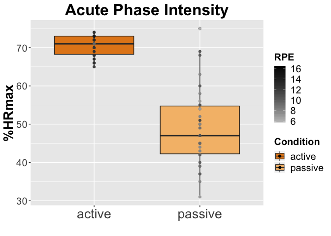
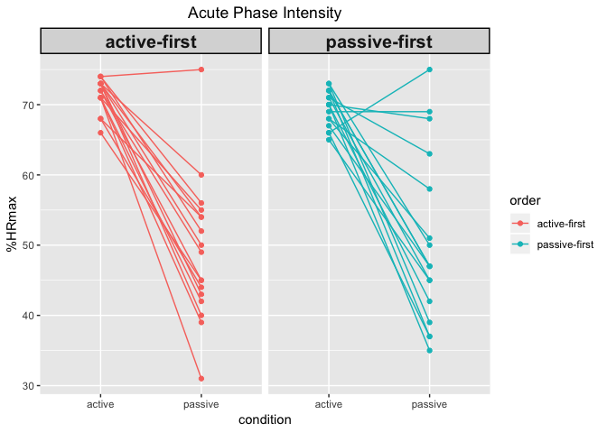

Examples for common file prep, plotting, anova, and regression
================
Michelle Voss

-   [**Clear previous, load packages**](#clear-previous-load-packages)
-   [**Referring to variables in a dataset**](#referring-to-variables-in-a-dataset)
-   [**Reshaping from wide to long**](#reshaping-from-wide-to-long)
-   [**Plotting to understand the data**](#plotting-to-understand-the-data)
-   [**Paired t-test**](#paired-t-test)
-   [**Regression with dummy coding**](#regression-with-dummy-coding)
-   [**Regression with effect coding**](#regression-with-effect-coding)
-   [**Continuous predictors**](#continuous-predictors)

**Clear previous, load packages**
=================================

**This is a "wide format" file with data from our acute exercise manipulation in the bike project**
\* There are 34 participants, 11 variables

``` r
# load acute variables data file
data = read.table("exercise_fileprep-plots-anova_data/acute_physio-variables-forR.csv", header=TRUE, sep = ",", fill = TRUE)

# look at features of your variables (encoded as integer, numeric or factors?)
str(data)
```

    ## 'data.frame':    34 obs. of  11 variables:
    ##  $ bike_id    : int  142 206 202 225 228 223 247 252 270 290 ...
    ##  $ order      : int  1 0 0 1 1 0 1 0 1 1 ...
    ##  $ hr_active  : num  0.68 0.72 0.68 0.74 0.71 0.7 0.73 0.72 0.74 0.73 ...
    ##  $ hr_passive : num  0.54 0.47 0.51 0.52 0.55 0.42 0.43 0.47 0.56 0.6 ...
    ##  $ rpe_active : num  11.6 11.7 12.5 12 12.3 16.2 10.9 11.4 10.9 12.3 ...
    ##  $ rpe_passive: num  11.2 10.8 11.3 8 10.7 8.1 8 9 6.9 10 ...
    ##  $ fs_active  : num  2.9 4.8 3.8 3 2.9 3 5 3 3.25 2.8 ...
    ##  $ fs_passive : num  -1 4.9 3.2 3 4 3 5 3 5 5 ...
    ##  $ fas_active : num  1.4 5 2.2 2 2 3 1 2 1 2 ...
    ##  $ fas_passive: num  2.2 4.1 1.9 2 1.3 3 1 1 1.1 1 ...
    ##  $ subject_id : Factor w/ 33 levels "GEA161","GEA270",..: 26 31 30 27 28 32 29 33 2 3 ...

**Referring to variables in a dataset**
=======================================

``` r
# change hr to percent for clarity of axes
# generic call of variable is dataframe$variable
# read <- as "is given by"
# here we are recoding, rather than making a new variable

data$hr_active <- 100*data$hr_active 
data$hr_passive <- 100*data$hr_passive
```

**Reshaping from wide to long**
===============================

-   Especially for longitudinal data, long format is much "tidyer"
-   One nugget of info fits in each cell and use columns to label attributes of variable values

``` r
# reshape is a function to help transform from wide to long 
# look at the dataframe to see if you can tell how it's working
# it will not work if the variable name has two delimiters (e.g. notice all variables have only one underscore)
# when you name your variables initially, it's is very helpful to have the variable attribute (e.g., session, condition) following the underscore

data_long<-reshape(data,
                             varying=c(3:10),
                             timevar="condition",
                             direction="long",
                             idvar="bike_id",
                             sep="_") 
```

**Plotting to understand the data**
===================================

-   label your chunk and any figures will be saved in a directory at low-res for rendering on github or sending to colleagues
-   Histograms and boxplots are nice for initial description
-   Familiarize with distribution shape (normal or skewed) and anything funky (outliers)

Simple box plot
\* aes &lt;- aesthetics, basic parameters of what to plot from the dataframe
\* generic call: ggplot(dataframe,aes(x=variable-on-x-axis,y=variable-on-y-axis,fill=variable-to-color-code))
\* geom\_boxplot() make a boxplot
\* <https://ggplot2.tidyverse.org/reference/geom_boxplot.html>
\* <http://www.sthda.com/english/wiki/ggplot2-box-plot-quick-start-guide-r-software-and-data-visualization>
\* geom\_point() add points for individuals by making a scatter plot with a factor variable here
\* <https://ggplot2.tidyverse.org/reference/geom_point.html>

``` r
ggplot(data_long, aes(x=condition,y=hr,fill=condition)) +
  geom_boxplot() +
  geom_point() +
  labs(title="Acute Phase Intensity",y="%HRmax",x="",fill="Condition") 
```


**GGplot is powerful and can help you add a lot of information to a plot like below**

``` r
# center title
theme_update(plot.title = element_text(hjust = 0.5))

# ggplot tool
# each parentheses after the + adds a new feature to the plot

ggplot(data_long, aes(x=condition,y=hr,fill=condition)) + 
  scale_fill_manual(values=c("#E3871C", "#F5BD78")) +
  geom_boxplot() + 
  geom_point(aes(color=rpe)) +
  scale_color_gradient(low="gray",high="black",name="RPE") +
  labs(title="Acute Phase Intensity",y="%HRmax",x="",fill="Condition") +
  geom_text(aes(label=ifelse((hr>(quantile(hr,.75)+3*IQR(hr))|hr<(quantile(hr,.25)-3*IQR(hr))),paste(subject_id),"")), hjust=1.1, check_overlap = TRUE, size=3) + 
  theme(title=element_text(size=20, face='bold'),
        axis.text.x = element_text(size=20),
        axis.text.y = element_text(size=15),
        axis.title.y = element_text(size=20),
        legend.text = element_text(size=15),
        legend.title = element_text(size=15))
```



``` r
# save a high-resolution file in your directory for pub-level figures
ggsave("acute-hr.tiff", width = 200, height = 100, units = "mm",dpi=300) 
```

**How about a bar graph with error bars?**
\* fun.data=mean\_se -&gt; standard error
\* fun.data=mean\_cl\_normal -&gt; confidence interval
\* Web resources
\* <http://murraylax.org/rtutorials/barplots.html>

``` r
# center title
theme_update(plot.title = element_text(hjust = 0.5))

ggplot(data = data_long, aes(x = condition, y = hr)) +
  stat_summary(aes(y = hr), size=.5, fun.y = mean, geom="bar",size=1) + 
  stat_summary(fun.data=mean_cl_normal, geom="errorbar", size=.5,width=.3) + 
  labs(title="Acute Phase Intensity",y="%HRmax",x="",fill="Condition")  +
  scale_x_discrete(name="Condition") + 
  scale_y_continuous(name = "%HRmax") +
  ylim(0,100) +
  theme(title=element_text(size=20, face='bold'),
        axis.text.x = element_text(size=20,face='bold',angle = 30, hjust = 1),
        axis.text.y = element_text(size=20,face='bold'),
        axis.title.y = element_text(size=15))
```

    ## Warning: The plyr::rename operation has created duplicates for the
    ## following name(s): (`size`)

    ## Scale for 'y' is already present. Adding another scale for 'y', which
    ## will replace the existing scale.


**Show individuals on one plot**

``` r
ggplot(data_long, aes(x=condition,y=hr,group=bike_id,color=order)) + 
  geom_line() + 
  geom_point() +
  labs(title="Acute Phase Intensity",y="%HRmax")
```


**Power of facet wrap to plot by a factor**
\* by variable factor

``` r
# add labels to a dummy coded factor
data_long$order<-factor(data_long$order,levels=c(1,0),labels=c("active-first","passive-first"))  


ggplot(data_long, aes(x=condition,y=hr,group=bike_id,color=order)) + 
  geom_line() + 
  geom_point() +
  facet_wrap(~order) +
  labs(title="Acute Phase Intensity",y="%HRmax") + 
  theme(strip.text = element_text(face="bold", size=15,lineheight=5.0), 
        strip.background = element_rect(colour="black", size=1))
```



-   by subject

``` r
ggplot(data_long, aes(x=condition,y=hr,group=bike_id,color=order)) + 
  geom_line() + 
  geom_point() +
  facet_wrap(~bike_id)
```


**Paired t-test**
=================

-   nice little tutorial with graphing supplements
-   <https://rcompanion.org/rcompanion/d_09.html>

-   for wide format

``` r
t.test(data$hr_active, 
       data$hr_passive, 
       paired=TRUE, 
       conf.level=0.95)
```

    ## 
    ##  Paired t-test
    ## 
    ## data:  data$hr_active and data$hr_passive
    ## t = 10.802, df = 33, p-value = 2.264e-12
    ## alternative hypothesis: true difference in means is not equal to 0
    ## 95 percent confidence interval:
    ##  16.97324 24.85029
    ## sample estimates:
    ## mean of the differences 
    ##                20.91176

-   for long format

``` r
t.test(hr ~ condition, 
       data=data_long, 
       paired=TRUE, 
       conf.level=0.95)
```

    ## 
    ##  Paired t-test
    ## 
    ## data:  hr by condition
    ## t = 10.802, df = 33, p-value = 2.264e-12
    ## alternative hypothesis: true difference in means is not equal to 0
    ## 95 percent confidence interval:
    ##  16.97324 24.85029
    ## sample estimates:
    ## mean of the differences 
    ##                20.91176

**ANOVAs**
\* nice little tutorial
\* <http://singmann.org/anova-in-r-afex-may-be-the-solution-you-are-looking-for/>

-   long format

``` r
# does hr difference by condition also interact with order of sessions?
library(car)
```

    ## 
    ## Attaching package: 'car'

    ## The following object is masked from 'package:dplyr':
    ## 
    ##     recode

    ## The following object is masked from 'package:purrr':
    ## 
    ##     some

``` r
library(afex)
```

    ## Loading required package: lme4

    ## Loading required package: Matrix

    ## 
    ## Attaching package: 'Matrix'

    ## The following object is masked from 'package:tidyr':
    ## 
    ##     expand

    ## Loading required package: emmeans

    ## ************
    ## Welcome to afex. For support visit: http://afex.singmann.science/

    ## - Functions for ANOVAs: aov_car(), aov_ez(), and aov_4()
    ## - Methods for calculating p-values with mixed(): 'KR', 'S', 'LRT', and 'PB'
    ## - 'afex_aov' and 'mixed' objects can be passed to emmeans() for follow-up tests
    ## - Get and set global package options with: afex_options()
    ## - Set orthogonal sum-to-zero contrasts globally: set_sum_contrasts()
    ## - For example analyses see: browseVignettes("afex")
    ## ************

    ## 
    ## Attaching package: 'afex'

    ## The following object is masked from 'package:lme4':
    ## 
    ##     lmer

``` r
# repeated measures variables specified in error term by subject
# if you had no repeated meaures values you would write: Error(bike_id)
# if you had two repeated meaures values you would write: Error(bike_id/variable1*variable2)

aovHR<-aov_car(hr~condition*order+Error(bike_id/condition),data_long)
```

    ## Contrasts set to contr.sum for the following variables: order

``` r
nice(aovHR)
```

    ## Anova Table (Type 3 tests)
    ## 
    ## Response: hr
    ##            Effect    df   MSE          F   ges p.value
    ## 1           order 1, 32 65.28       0.04 .0006     .85
    ## 2       condition 1, 32 64.31 115.60 ***   .64  <.0001
    ## 3 order:condition 1, 32 64.31       0.69   .01     .41
    ## ---
    ## Signif. codes:  0 '***' 0.001 '**' 0.01 '*' 0.05 '+' 0.1 ' ' 1

``` r
aovHR_fitted<-lsmeans(aovHR,~condition|order)
aovHR_fitted
```

    ## order = active-first:
    ##  condition   lsmean       SE df lower.CL upper.CL
    ##  active    71.58824 1.952258 64 67.68815 75.48832
    ##  passive   49.05882 1.952258 64 45.15874 52.95891
    ## 
    ## order = passive-first:
    ##  condition   lsmean       SE df lower.CL upper.CL
    ##  active    69.58824 1.952258 64 65.68815 73.48832
    ##  passive   50.29412 1.952258 64 46.39403 54.19421
    ## 
    ## Confidence level used: 0.95

``` r
pairs(aovHR_fitted)
```

    ## order = active-first:
    ##  contrast         estimate      SE df t.ratio p.value
    ##  active - passive 22.52941 2.75059 32   8.191  <.0001
    ## 
    ## order = passive-first:
    ##  contrast         estimate      SE df t.ratio p.value
    ##  active - passive 19.29412 2.75059 32   7.015  <.0001

**Regression with dummy coding**
================================

-   nice little conceptual examples for coding predictors and implications for interpretation
-   <http://faculty.cas.usf.edu/mbrannick/regression/anova1.html>
-   <http://www.lrdc.pitt.edu/maplelab/slides/Simple_Main_Effects_Fraundorf.pdf>

-   use long format

Check data structure

``` r
str(data_long)
```

    ## 'data.frame':    68 obs. of  8 variables:
    ##  $ bike_id   : int  142 206 202 225 228 223 247 252 270 290 ...
    ##  $ order     : Factor w/ 2 levels "active-first",..: 1 2 2 1 1 2 1 2 1 1 ...
    ##  $ subject_id: Factor w/ 33 levels "GEA161","GEA270",..: 26 31 30 27 28 32 29 33 2 3 ...
    ##  $ condition : chr  "active" "active" "active" "active" ...
    ##  $ hr        : num  68 72 68 74 71 70 73 72 74 73 ...
    ##  $ rpe       : num  11.6 11.7 12.5 12 12.3 16.2 10.9 11.4 10.9 12.3 ...
    ##  $ fs        : num  2.9 4.8 3.8 3 2.9 3 5 3 3.25 2.8 ...
    ##  $ fas       : num  1.4 5 2.2 2 2 3 1 2 1 2 ...
    ##  - attr(*, "reshapeLong")=List of 4
    ##   ..$ varying:List of 4
    ##   .. ..$ hr : chr  "hr_active" "hr_passive"
    ##   .. ..$ rpe: chr  "rpe_active" "rpe_passive"
    ##   .. ..$ fs : chr  "fs_active" "fs_passive"
    ##   .. ..$ fas: chr  "fas_active" "fas_passive"
    ##   .. ..- attr(*, "v.names")= chr  "hr" "rpe" "fs" "fas"
    ##   .. ..- attr(*, "times")= chr  "active" "passive"
    ##   ..$ v.names: chr  "hr" "rpe" "fs" "fas"
    ##   ..$ idvar  : chr "bike_id"
    ##   ..$ timevar: chr "condition"

Change condition to a factor

``` r
data_long$condition <-as.factor(data_long$condition)
str(data_long)
```

    ## 'data.frame':    68 obs. of  8 variables:
    ##  $ bike_id   : int  142 206 202 225 228 223 247 252 270 290 ...
    ##  $ order     : Factor w/ 2 levels "active-first",..: 1 2 2 1 1 2 1 2 1 1 ...
    ##  $ subject_id: Factor w/ 33 levels "GEA161","GEA270",..: 26 31 30 27 28 32 29 33 2 3 ...
    ##  $ condition : Factor w/ 2 levels "active","passive": 1 1 1 1 1 1 1 1 1 1 ...
    ##  $ hr        : num  68 72 68 74 71 70 73 72 74 73 ...
    ##  $ rpe       : num  11.6 11.7 12.5 12 12.3 16.2 10.9 11.4 10.9 12.3 ...
    ##  $ fs        : num  2.9 4.8 3.8 3 2.9 3 5 3 3.25 2.8 ...
    ##  $ fas       : num  1.4 5 2.2 2 2 3 1 2 1 2 ...
    ##  - attr(*, "reshapeLong")=List of 4
    ##   ..$ varying:List of 4
    ##   .. ..$ hr : chr  "hr_active" "hr_passive"
    ##   .. ..$ rpe: chr  "rpe_active" "rpe_passive"
    ##   .. ..$ fs : chr  "fs_active" "fs_passive"
    ##   .. ..$ fas: chr  "fas_active" "fas_passive"
    ##   .. ..- attr(*, "v.names")= chr  "hr" "rpe" "fs" "fas"
    ##   .. ..- attr(*, "times")= chr  "active" "passive"
    ##   ..$ v.names: chr  "hr" "rpe" "fs" "fas"
    ##   ..$ idvar  : chr "bike_id"
    ##   ..$ timevar: chr "condition"

Check constrast coding \* notice "dummy coding" is default

``` r
contrasts(data_long$condition)
```

    ##         passive
    ## active        0
    ## passive       1

``` r
contrasts(data_long$order)
```

    ##               passive-first
    ## active-first              0
    ## passive-first             1

With dummy coding, we typically want our control group or condition as the reference. This doesn't apply to order, but let's change the coding for condition so that passive is coded as 0.

``` r
contrasts(data_long$condition)=c(1,0)
```

``` r
contrasts(data_long$condition)
```

    ##         [,1]
    ## active     1
    ## passive    0

For reference, let's print our our cell means for the 2 x 2 of order*condition * also see stargazer as a tool for outputting nice tables of descriptives that can be directly copied into a word doc
\* <https://www.jakeruss.com/cheatsheets/stargazer/>

``` r
library(psych)
```

    ## 
    ## Attaching package: 'psych'

    ## The following object is masked from 'package:car':
    ## 
    ##     logit

    ## The following objects are masked from 'package:ggplot2':
    ## 
    ##     %+%, alpha

``` r
describe(data_long)
```

    ##             vars  n   mean     sd median trimmed   mad min   max range
    ## bike_id        1 68 333.68 103.51 321.00  331.64 98.59 142 529.0 387.0
    ## order*         2 68   1.50   0.50   1.50    1.50  0.74   1   2.0   1.0
    ## subject_id*    3 66  17.00   9.59  17.00   17.00 11.86   1  33.0  32.0
    ## condition*     4 68   1.50   0.50   1.50    1.50  0.74   1   2.0   1.0
    ## hr             5 68  60.13  13.17  66.50   61.18  9.64  31  75.0  44.0
    ## rpe            6 68  10.54   2.06  10.90   10.56  2.08   6  16.2  10.2
    ## fs             7 68   2.67   1.43   3.00    2.72  1.41  -1   5.0   6.0
    ## fas            8 68   1.86   0.91   1.98    1.74  1.45   1   5.0   4.0
    ##              skew kurtosis    se
    ## bike_id      0.24    -0.81 12.55
    ## order*       0.00    -2.03  0.06
    ## subject_id*  0.00    -1.26  1.18
    ## condition*   0.00    -2.03  0.06
    ## hr          -0.56    -1.23  1.60
    ## rpe         -0.07    -0.33  0.25
    ## fs          -0.36    -0.38  0.17
    ## fas          1.07     0.88  0.11

``` r
describeBy(data_long,list(data_long$order,data_long$condition))
```

    ## 
    ##  Descriptive statistics by group 
    ## : active-first
    ## : active
    ##             vars  n   mean     sd median trimmed    mad   min   max range
    ## bike_id        1 17 319.88 105.84  311.0  318.80 106.75 142.0 514.0 372.0
    ## order*         2 17   1.00   0.00    1.0    1.00   0.00   1.0   1.0   0.0
    ## subject_id*    3 17  11.82   9.59    9.0   11.40   5.93   1.0  29.0  28.0
    ## condition*     4 17   1.00   0.00    1.0    1.00   0.00   1.0   1.0   0.0
    ## hr             5 17  71.59   2.32   72.0   71.80   1.48  66.0  74.0   8.0
    ## rpe            6 17  11.74   0.86   11.6   11.73   1.04  10.3  13.4   3.1
    ## fs             7 17   2.56   1.02    2.9    2.55   0.52   0.3   5.0   4.7
    ## fas            8 17   1.84   0.80    2.0    1.75   0.44   1.0   4.0   3.0
    ##              skew kurtosis    se
    ## bike_id      0.17    -0.93 25.67
    ## order*        NaN      NaN  0.00
    ## subject_id*  0.77    -1.01  2.33
    ## condition*    NaN      NaN  0.00
    ## hr          -1.00    -0.10  0.56
    ## rpe          0.21    -1.11  0.21
    ## fs          -0.04     0.77  0.25
    ## fas          1.06     0.85  0.19
    ## -------------------------------------------------------- 
    ## : passive-first
    ## : active
    ##             vars  n   mean     sd median trimmed   mad   min   max range
    ## bike_id        1 17 347.47 104.06  327.0  345.07 85.99 202.0 529.0 327.0
    ## order*         2 17   2.00   0.00    2.0    2.00  0.00   2.0   2.0   0.0
    ## subject_id*    3 16  22.50   6.22   21.5   22.36  5.93  14.0  33.0  19.0
    ## condition*     4 17   1.00   0.00    1.0    1.00  0.00   1.0   1.0   0.0
    ## hr             5 17  69.59   2.55   70.0   69.67  2.97  65.0  73.0   8.0
    ## rpe            6 17  12.44   1.44   12.3   12.39  0.89   9.5  16.2   6.7
    ## fs             7 17   2.43   1.42    3.0    2.43  0.44   0.0   4.8   4.8
    ## fas            8 17   2.34   1.07    2.2    2.26  1.19   1.0   5.0   4.0
    ##              skew kurtosis    se
    ## bike_id      0.30    -1.20 25.24
    ## order*        NaN      NaN  0.00
    ## subject_id*  0.37    -1.31  1.55
    ## condition*    NaN      NaN  0.00
    ## hr          -0.31    -1.32  0.62
    ## rpe          0.75     1.17  0.35
    ## fs          -0.53    -1.02  0.34
    ## fas          0.57    -0.07  0.26
    ## -------------------------------------------------------- 
    ## : active-first
    ## : passive
    ##             vars  n   mean     sd median trimmed    mad   min   max range
    ## bike_id        1 17 319.88 105.84  311.0  318.80 106.75 142.0 514.0 372.0
    ## order*         2 17   1.00   0.00    1.0    1.00   0.00   1.0   1.0   0.0
    ## subject_id*    3 17  11.82   9.59    9.0   11.40   5.93   1.0  29.0  28.0
    ## condition*     4 17   2.00   0.00    2.0    2.00   0.00   2.0   2.0   0.0
    ## hr             5 17  49.06   9.97   49.0   48.53   8.90  31.0  75.0  44.0
    ## rpe            6 17   9.11   1.47    9.1    9.11   1.63   6.9  11.2   4.3
    ## fs             7 17   3.12   1.73    3.0    3.27   1.48  -1.0   5.0   6.0
    ## fas            8 17   1.44   0.59    1.1    1.36   0.15   1.0   3.0   2.0
    ##              skew kurtosis    se
    ## bike_id      0.17    -0.93 25.67
    ## order*        NaN      NaN  0.00
    ## subject_id*  0.77    -1.01  2.33
    ## condition*    NaN      NaN  0.00
    ## hr           0.66     0.58  2.42
    ## rpe         -0.12    -1.44  0.36
    ## fs          -0.80    -0.23  0.42
    ## fas          1.19     0.35  0.14
    ## -------------------------------------------------------- 
    ## : passive-first
    ## : passive
    ##             vars  n   mean     sd median trimmed   mad min   max range
    ## bike_id        1 17 347.47 104.06  327.0  345.07 85.99 202 529.0 327.0
    ## order*         2 17   2.00   0.00    2.0    2.00  0.00   2   2.0   0.0
    ## subject_id*    3 16  22.50   6.22   21.5   22.36  5.93  14  33.0  19.0
    ## condition*     4 17   2.00   0.00    2.0    2.00  0.00   2   2.0   0.0
    ## hr             5 17  50.29  12.16   47.0   49.67 11.86  35  75.0  40.0
    ## rpe            6 17   8.86   1.49    8.1    8.89  1.63   6  11.3   5.3
    ## fs             7 17   2.58   1.49    3.0    2.59  1.63   0   5.0   5.0
    ## fas            8 17   1.81   0.95    1.9    1.71  1.33   1   4.1   3.1
    ##              skew kurtosis    se
    ## bike_id      0.30    -1.20 25.24
    ## order*        NaN      NaN  0.00
    ## subject_id*  0.37    -1.31  1.55
    ## condition*    NaN      NaN  0.00
    ## hr           0.62    -0.95  2.95
    ## rpe         -0.03    -1.19  0.36
    ## fs          -0.02    -1.28  0.36
    ## fas          0.82    -0.39  0.23

``` r
# set bike_id as a factor since repeated measures are grouped by subject
data_long$bike_id <- as.factor(data_long$bike_id)

# the (1 | bike_id) text below helps account for the fact that there are repeated measures for subject
lm_hr_dummy<-lmer(hr ~ condition*order + (1|bike_id), data=data_long)
summary(lm_hr_dummy)
```

    ## Linear mixed model fit by REML t-tests use Satterthwaite approximations
    ##   to degrees of freedom [lmerMod]
    ## Formula: hr ~ condition * order + (1 | bike_id)
    ##    Data: data_long
    ## 
    ## REML criterion at convergence: 459.9
    ## 
    ## Scaled residuals: 
    ##     Min      1Q  Median      3Q     Max 
    ## -2.2347 -0.4745  0.0135  0.2972  3.2087 
    ## 
    ## Random effects:
    ##  Groups   Name        Variance Std.Dev.
    ##  bike_id  (Intercept)  0.4835  0.6953  
    ##  Residual             64.3088  8.0193  
    ## Number of obs: 68, groups:  bike_id, 34
    ## 
    ## Fixed effects:
    ##                               Estimate Std. Error     df t value Pr(>|t|)
    ## (Intercept)                     49.059      1.952 64.000  25.129  < 2e-16
    ## condition1                      22.529      2.751 32.000   8.191 2.35e-09
    ## orderpassive-first               1.235      2.761 64.000   0.447    0.656
    ## condition1:orderpassive-first   -3.235      3.890 32.000  -0.832    0.412
    ##                                  
    ## (Intercept)                   ***
    ## condition1                    ***
    ## orderpassive-first               
    ## condition1:orderpassive-first    
    ## ---
    ## Signif. codes:  0 '***' 0.001 '**' 0.01 '*' 0.05 '.' 0.1 ' ' 1
    ## 
    ## Correlation of Fixed Effects:
    ##             (Intr) cndtn1 ordrp-
    ## condition1  -0.704              
    ## ordrpssv-fr -0.707  0.498       
    ## cndtn1:rdr-  0.498 -0.707 -0.704

Below is an example of formatting the model results that is better for presentation. If you replace "text" with "html" then stargazer will save the table in an .html format, which you can then open in word to copy/paste the formatted table into your results tables.

``` r
class(lm_hr_dummy) <- "lmerMod"
stargazer(lm_hr_dummy,type="text",
          dep.var.labels=c("%HRR during exercise"),
          covariate.labels = c("Intercept","Condition","Order","Condition*Order"),
          star.cutoffs = c(0.05, 0.01, 0.001),
          intercept.bottom = FALSE)
```

    ## 
    ## =================================================
    ##                          Dependent variable:     
    ##                     -----------------------------
    ##                         %HRR during exercise     
    ## -------------------------------------------------
    ## Intercept                     49.059***          
    ##                                (1.952)           
    ##                                                  
    ## Condition                     22.529***          
    ##                                (2.751)           
    ##                                                  
    ## Order                           1.235            
    ##                                (2.761)           
    ##                                                  
    ## Condition*Order                -3.235            
    ##                                (3.890)           
    ##                                                  
    ## -------------------------------------------------
    ## Observations                     68              
    ## Log Likelihood                -229.956           
    ## Akaike Inf. Crit.              471.911           
    ## Bayesian Inf. Crit.            485.228           
    ## =================================================
    ## Note:               *p<0.05; **p<0.01; ***p<0.001

Interpretations
\* What does the intercept represent?
\* Generally, intercept is the mean of DV when all predictors are 0
\* We dummy-coded our predictors...
\* So intercept is mean HR when cond=0 (passive) and order=0 (active-first), match above? Yep (49.06)

-   Condition
-   Has a 1 after label to indicate the parameter is for the contrast of \[1 0\], or here \[active passive\]
    -   This represents the mean difference of active-passive, ONLY AT THE REFERENCE for the order variable!
    -   reference: where order=0 (active-first)
-   Order
-   label indicates passive-first coded as a 1
-   As above, represents mean difference of order conditions, only where the other factor 0 (passive condition)
    -   Check this for yourself!
-   Interaction
-   Generally, an interaction refers to when the difference in conditions for a variable depends on the level of another variable
    -   In words here, does the effect of condition on hr depend on which condition was first?
-   Parameter reflects difference of differences: [level:passive-first](active-passive) -[level:active-first](active-passive)
-   Interpretation: HR doesn't seem to depend on order, yay!

-   If we only care about the interaction, this is fine. But if we care about effect of condition regardless or order (e.g., a "main effect" of condition) we don't really that above like we did in the anova. We can change our coding scheme for factors to allow for this though.

**Regression with effect coding**
=================================

For a two-level variable, effect coding assigns levels as 1, -1

Remind ourselves of factor levels

``` r
levels(data_long$condition)
```

    ## [1] "active"  "passive"

``` r
levels(data_long$order)
```

    ## [1] "active-first"  "passive-first"

Let's do this for both factors, where -.5 is our control condition if we have one

``` r
contrasts(data_long$condition)=c(.5,-.5)
contrasts(data_long$order)=c(-.5,.5)
```

Check!

``` r
contrasts(data_long$condition)
```

    ##         [,1]
    ## active   0.5
    ## passive -0.5

``` r
contrasts(data_long$order)
```

    ##               [,1]
    ## active-first  -0.5
    ## passive-first  0.5

Run the same regression model, now with effect coded factors..

``` r
lm_hr_effect<-lmer(hr ~ condition*order + (1|bike_id), data=data_long)
summary(lm_hr_effect)
```

    ## Linear mixed model fit by REML t-tests use Satterthwaite approximations
    ##   to degrees of freedom [lmerMod]
    ## Formula: hr ~ condition * order + (1 | bike_id)
    ##    Data: data_long
    ## 
    ## REML criterion at convergence: 459.9
    ## 
    ## Scaled residuals: 
    ##     Min      1Q  Median      3Q     Max 
    ## -2.2347 -0.4745  0.0135  0.2972  3.2087 
    ## 
    ## Random effects:
    ##  Groups   Name        Variance Std.Dev.
    ##  bike_id  (Intercept)  0.4835  0.6953  
    ##  Residual             64.3088  8.0193  
    ## Number of obs: 68, groups:  bike_id, 34
    ## 
    ## Fixed effects:
    ##                   Estimate Std. Error      df t value Pr(>|t|)    
    ## (Intercept)        60.1324     0.9798 32.0000  61.374  < 2e-16 ***
    ## condition1         20.9118     1.9450 32.0000  10.752 3.74e-12 ***
    ## order1             -0.3824     1.9595 32.0000  -0.195    0.847    
    ## condition1:order1  -3.2353     3.8899 32.0000  -0.832    0.412    
    ## ---
    ## Signif. codes:  0 '***' 0.001 '**' 0.01 '*' 0.05 '.' 0.1 ' ' 1
    ## 
    ## Correlation of Fixed Effects:
    ##             (Intr) cndtn1 order1
    ## condition1  0.000               
    ## order1      0.000  0.000        
    ## cndtn1:rdr1 0.000  0.000  0.000

Interpretations
\* What does the intercept represent?
\* Generally, intercept is the mean of DV when all predictors are 0
\* We effect-coded our predictors...
\* So intercept is mean HR when cond=0 (passive) and order=0 (active-first), match above?
\* That is now the grand mean across all conditions (60.13)

-   Condition
-   Label indicates the parameter is for the contrast of \[1 -1\], or here \[active passive\]
    -   This represents the mean difference of active-passive, now at the MEAN of the order variable
    -   This is like our main effect of condition, regardless of order
-   Order
-   label indicates contrast for \[1 -1\]
-   As above, represents mean difference of order conditions, holding condition constant at its MEAN

-   Interaction
-   Same as when we dummy coded...

**Continuous predictors**
=========================

-   Similar to rationale for effect coding, **if** the continous predictor is modeled to interact with the categorical predictors, it usually makes sense to mean-center a continous predictor so that other parameters reflect the effect of that variable at the mean-level of the continous predictor.
-   If the continuous predictors are not interacting with the categorical predictors, they're treated more like covariates in parameters.

Example, let's test if hr in the acute sessions is predicted by resting heart rate or cardiorespiratory fitness..

bring these variables in from another .csv

``` r
subvariables = read.table("exercise_fileprep-plots-anova_data/subvariables.csv", header=TRUE, sep = ",", fill = TRUE)
subvariables.k = subvariables %>% select(bike_id,rhr_m0,vo2rel_m0)

data_long <- merge(data_long,subvariables,all.x=TRUE, by="bike_id")
```

Resting heart rate as a covariate...

``` r
lm_hr_effect.c<-lmer(hr ~ condition*order+rhr_m0 + (1|bike_id), data=data_long)
summary(lm_hr_effect.c)
```

    ## Linear mixed model fit by REML t-tests use Satterthwaite approximations
    ##   to degrees of freedom [lmerMod]
    ## Formula: hr ~ condition * order + rhr_m0 + (1 | bike_id)
    ##    Data: data_long
    ## 
    ## REML criterion at convergence: 456.3
    ## 
    ## Scaled residuals: 
    ##     Min      1Q  Median      3Q     Max 
    ## -1.8479 -0.4982 -0.1262  0.3312  3.4065 
    ## 
    ## Random effects:
    ##  Groups   Name        Variance  Std.Dev.
    ##  bike_id  (Intercept) 5.228e-13 7.23e-07
    ##  Residual             5.960e+01 7.72e+00
    ## Number of obs: 68, groups:  bike_id, 34
    ## 
    ## Fixed effects:
    ##                   Estimate Std. Error      df t value Pr(>|t|)    
    ## (Intercept)        42.6098     6.8970 63.0000   6.178 5.28e-08 ***
    ## condition1         20.9118     1.8724 63.0000  11.168  < 2e-16 ***
    ## order1             -1.0195     1.8888 63.0000  -0.540   0.5913    
    ## rhr_m0              0.2579     0.1006 63.0000   2.564   0.0127 *  
    ## condition1:order1  -3.2353     3.7448 63.0000  -0.864   0.3909    
    ## ---
    ## Signif. codes:  0 '***' 0.001 '**' 0.01 '*' 0.05 '.' 0.1 ' ' 1
    ## 
    ## Correlation of Fixed Effects:
    ##             (Intr) cndtn1 order1 rhr_m0
    ## condition1   0.000                     
    ## order1       0.130  0.000              
    ## rhr_m0      -0.991  0.000 -0.132       
    ## cndtn1:rdr1  0.000  0.000  0.000  0.000

Resting heart rate as a covariate WITH mean-centering by z-score scaling...

``` r
lm_hr_effect.c<-lmer(hr ~ condition*order+scale(rhr_m0) + (1|bike_id), data=data_long)
summary(lm_hr_effect.c)
```

    ## Linear mixed model fit by REML t-tests use Satterthwaite approximations
    ##   to degrees of freedom [lmerMod]
    ## Formula: hr ~ condition * order + scale(rhr_m0) + (1 | bike_id)
    ##    Data: data_long
    ## 
    ## REML criterion at convergence: 451.8
    ## 
    ## Scaled residuals: 
    ##     Min      1Q  Median      3Q     Max 
    ## -1.8479 -0.4982 -0.1262  0.3312  3.4065 
    ## 
    ## Random effects:
    ##  Groups   Name        Variance  Std.Dev.
    ##  bike_id  (Intercept) 5.228e-13 7.23e-07
    ##  Residual             5.960e+01 7.72e+00
    ## Number of obs: 68, groups:  bike_id, 34
    ## 
    ## Fixed effects:
    ##                   Estimate Std. Error      df t value Pr(>|t|)    
    ## (Intercept)        60.1324     0.9362 63.0000  64.230   <2e-16 ***
    ## condition1         20.9118     1.8724 63.0000  11.168   <2e-16 ***
    ## order1             -1.0195     1.8888 63.0000  -0.540   0.5913    
    ## scale(rhr_m0)       2.4398     0.9514 63.0000   2.564   0.0127 *  
    ## condition1:order1  -3.2353     3.7448 63.0000  -0.864   0.3909    
    ## ---
    ## Signif. codes:  0 '***' 0.001 '**' 0.01 '*' 0.05 '.' 0.1 ' ' 1
    ## 
    ## Correlation of Fixed Effects:
    ##             (Intr) cndtn1 order1 sc(_0)
    ## condition1   0.000                     
    ## order1       0.000  0.000              
    ## scl(rhr_m0)  0.000  0.000 -0.132       
    ## cndtn1:rdr1  0.000  0.000  0.000  0.000

Resting heart rate in the interaction...
\* translate what you saw with dummy vs effect coding, why doesn't this make any sense to do when looking at condition and order effects?

``` r
lm_hr_effect.c<-lmer(hr ~ condition*order*rhr_m0 + (1|bike_id), data=data_long)
summary(lm_hr_effect.c)
```

    ## Linear mixed model fit by REML t-tests use Satterthwaite approximations
    ##   to degrees of freedom [lmerMod]
    ## Formula: hr ~ condition * order * rhr_m0 + (1 | bike_id)
    ##    Data: data_long
    ## 
    ## REML criterion at convergence: 455.4
    ## 
    ## Scaled residuals: 
    ##     Min      1Q  Median      3Q     Max 
    ## -1.6039 -0.4466 -0.0132  0.2195  3.6296 
    ## 
    ## Random effects:
    ##  Groups   Name        Variance  Std.Dev. 
    ##  bike_id  (Intercept) 8.104e-13 9.002e-07
    ##  Residual             5.914e+01 7.690e+00
    ## Number of obs: 68, groups:  bike_id, 34
    ## 
    ## Fixed effects:
    ##                          Estimate Std. Error       df t value Pr(>|t|)    
    ## (Intercept)              41.58681    7.14403 60.00000   5.821 2.44e-07 ***
    ## condition1               45.69995   14.28806 60.00000   3.198  0.00221 ** 
    ## order1                   -8.41755   14.28806 60.00000  -0.589  0.55798    
    ## rhr_m0                    0.27198    0.10374 60.00000   2.622  0.01107 *  
    ## condition1:order1         0.58758   28.57613 60.00000   0.021  0.98366    
    ## condition1:rhr_m0        -0.36446    0.20749 60.00000  -1.757  0.08410 .  
    ## order1:rhr_m0             0.10838    0.20749 60.00000   0.522  0.60337    
    ## condition1:order1:rhr_m0 -0.04301    0.41498 60.00000  -0.104  0.91779    
    ## ---
    ## Signif. codes:  0 '***' 0.001 '**' 0.01 '*' 0.05 '.' 0.1 ' ' 1
    ## 
    ## Correlation of Fixed Effects:
    ##             (Intr) cndtn1 order1 rhr_m0 cnd1:1 cn1:_0 or1:_0
    ## condition1   0.000                                          
    ## order1       0.288  0.000                                   
    ## rhr_m0      -0.991  0.000 -0.274                            
    ## cndtn1:rdr1  0.000  0.288  0.000  0.000                     
    ## cndtn1:rh_0  0.000 -0.991  0.000  0.000 -0.274              
    ## ordr1:rhr_0 -0.274  0.000 -0.991  0.260  0.000  0.000       
    ## cndtn1:1:_0  0.000 -0.274  0.000  0.000 -0.991  0.260  0.000

So this makes more sense if we want resting heart rate in the interaction

``` r
lm_hr_effect.c<-lmer(hr ~ condition*order*scale(rhr_m0)+ (1|bike_id), data=data_long)
summary(lm_hr_effect.c)
```

    ## Linear mixed model fit by REML t-tests use Satterthwaite approximations
    ##   to degrees of freedom [lmerMod]
    ## Formula: hr ~ condition * order * scale(rhr_m0) + (1 | bike_id)
    ##    Data: data_long
    ## 
    ## REML criterion at convergence: 437.5
    ## 
    ## Scaled residuals: 
    ##     Min      1Q  Median      3Q     Max 
    ## -1.6039 -0.4466 -0.0132  0.2195  3.6296 
    ## 
    ## Random effects:
    ##  Groups   Name        Variance  Std.Dev. 
    ##  bike_id  (Intercept) 1.918e-16 1.385e-08
    ##  Residual             5.914e+01 7.690e+00
    ## Number of obs: 68, groups:  bike_id, 34
    ## 
    ## Fixed effects:
    ##                                 Estimate Std. Error      df t value
    ## (Intercept)                      60.0654     0.9413 60.0000  63.809
    ## condition1                       20.9383     1.8827 60.0000  11.122
    ## order1                           -1.0543     1.8827 60.0000  -0.560
    ## scale(rhr_m0)                     2.5729     0.9814 60.0000   2.622
    ## condition1:order1                -2.3349     3.7653 60.0000  -0.620
    ## condition1:scale(rhr_m0)         -3.4477     1.9628 60.0000  -1.757
    ## order1:scale(rhr_m0)              1.0252     1.9628 60.0000   0.522
    ## condition1:order1:scale(rhr_m0)  -0.4069     3.9256 60.0000  -0.104
    ##                                 Pr(>|t|)    
    ## (Intercept)                      < 2e-16 ***
    ## condition1                      4.44e-16 ***
    ## order1                            0.5776    
    ## scale(rhr_m0)                     0.0111 *  
    ## condition1:order1                 0.5375    
    ## condition1:scale(rhr_m0)          0.0841 .  
    ## order1:scale(rhr_m0)              0.6034    
    ## condition1:order1:scale(rhr_m0)   0.9178    
    ## ---
    ## Signif. codes:  0 '***' 0.001 '**' 0.01 '*' 0.05 '.' 0.1 ' ' 1
    ## 
    ## Correlation of Fixed Effects:
    ##             (Intr) cndtn1 order1 sc(_0) cnd1:1 c1:(_0 o1:(_0
    ## condition1   0.000                                          
    ## order1       0.005  0.000                                   
    ## scl(rhr_m0) -0.035  0.000 -0.136                            
    ## cndtn1:rdr1  0.000  0.005  0.000  0.000                     
    ## cndtn1:(_0)  0.000 -0.035  0.000  0.000 -0.136              
    ## ordr1:s(_0) -0.136  0.000 -0.035  0.260  0.000  0.000       
    ## cnd1:1:(_0)  0.000 -0.136  0.000  0.000 -0.035  0.260  0.000

Reporting regression results

Often good to include a full table of beta parameters. Stargazer is a nice tool to help with this: \* <https://www.jakeruss.com/cheatsheets/stargazer/> \* <https://www.princeton.edu/~otorres/NiceOutputR.pdf>

``` r
# use this for lmer models
class(lm_hr_effect.c) <- "lmerMod"

stargazer(lm_hr_effect.c,type="text",
          dep.var.labels=c("%HRR during exercise"),
          covariate.labels = c("Intercept", "Condition","Order","Resting HR (RHR)","Condition*Order","Condition*RHR","Order*RHR","Condition*Order*RHR"),
          star.cutoffs = c(0.05, 0.01, 0.001),
          intercept.bottom = FALSE)
```

    ## 
    ## =================================================
    ##                          Dependent variable:     
    ##                     -----------------------------
    ##                         %HRR during exercise     
    ## -------------------------------------------------
    ## Intercept                     60.065***          
    ##                                (0.941)           
    ##                                                  
    ## Condition                     20.938***          
    ##                                (1.883)           
    ##                                                  
    ## Order                          -1.054            
    ##                                (1.883)           
    ##                                                  
    ## Resting HR (RHR)               2.573**           
    ##                                (0.981)           
    ##                                                  
    ## Condition*Order                -2.335            
    ##                                (3.765)           
    ##                                                  
    ## Condition*RHR                  -3.448            
    ##                                (1.963)           
    ##                                                  
    ## Order*RHR                       1.025            
    ##                                (1.963)           
    ##                                                  
    ## Condition*Order*RHR            -0.407            
    ##                                (3.926)           
    ##                                                  
    ## -------------------------------------------------
    ## Observations                     68              
    ## Log Likelihood                -218.731           
    ## Akaike Inf. Crit.              457.463           
    ## Bayesian Inf. Crit.            479.658           
    ## =================================================
    ## Note:               *p<0.05; **p<0.01; ***p<0.001

Plot to understand interactions, nifty tool in package jtools
\* <https://cran.r-project.org/web/packages/jtools/vignettes/interactions.html>

``` r
library(jtools)
```

``` r
interact_plot(lm_hr_effect.c, pred = "rhr_m0", modx = "condition",plot.points = TRUE, data=data_long)
```


Curious about CRF ?
\* What would you predict?
\* Test it!
