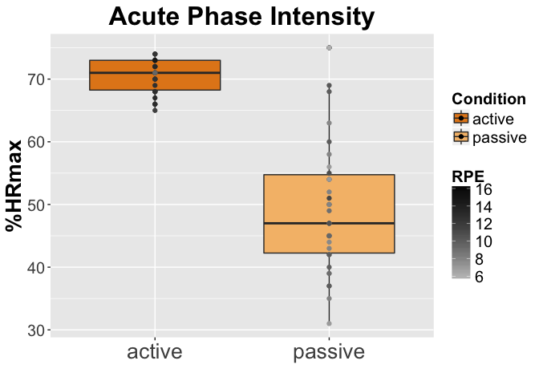
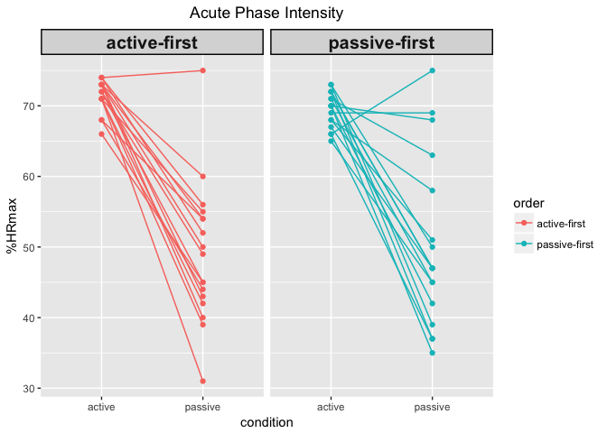

**Clear previous, load packages**


**This is a "wide format" file with data from our acute exercise manipulation in the bike project**  
* There are 34 participants, 11 variables


```r
# load acute variables data file
data = read.table("exercise_fileprep-plots-anova_data/acute_physio-variables-forR.csv", header=TRUE, sep = ",", fill = TRUE)

# look at features of your variables (encoded as integer, numeric or factors?)
str(data)
```

```
## 'data.frame':	34 obs. of  11 variables:
##  $ bike_id    : int  142 206 202 225 228 223 247 252 270 290 ...
##  $ order      : int  1 0 0 1 1 0 1 0 1 1 ...
##  $ hr_active  : num  0.68 0.72 0.68 0.74 0.71 0.7 0.73 0.72 0.74 0.73 ...
##  $ hr_passive : num  0.54 0.47 0.51 0.52 0.55 0.42 0.43 0.47 0.56 0.6 ...
##  $ rpe_active : num  11.6 11.7 12.5 12 12.3 16.2 10.9 11.4 10.9 12.3 ...
##  $ rpe_passive: num  11.2 10.8 11.3 8 10.7 8.1 8 9 6.9 10 ...
##  $ fs_active  : num  2.9 4.8 3.8 3 2.9 3 5 3 3.25 2.8 ...
##  $ fs_passive : num  -1 4.9 3.2 3 4 3 5 3 5 5 ...
##  $ fas_active : num  1.4 5 2.2 2 2 3 1 2 1 2 ...
##  $ fas_passive: num  2.2 4.1 1.9 2 1.3 3 1 1 1.1 1 ...
##  $ subject_id : Factor w/ 33 levels "GEA161","GEA270",..: 26 31 30 27 28 32 29 33 2 3 ...
```


**Referring to variables in a dataset**


```r
# change hr to percent for clarity of axes
# generic call of variable is dataframe$variable
# read <- as "is given by"
# here we are recoding, rather than making a new variable

data$hr_active <- 100*data$hr_active 
data$hr_passive <- 100*data$hr_passive
```


**Reshaping from wide to long**
* Especially for longitudinal data, long format is much "tidyer"  
  * One nugget of info fits in each cell and use columns to label attributes of variable values  
  
  

```r
# reshape is a function to help transform from wide to long 
# look at the dataframe to see if you can tell how it's working
# it will not work if the variable name has two delimiters (e.g. notice all variables have only one underscore)
# when you name your variables initially, it's is very helpful to have the variable attribute (e.g., session, condition) following the underscore

data_long<-reshape(data,
                             varying=c(3:10),
                             timevar="condition",
                             direction="long",
                             idvar="bike_id",
                             sep="_") 
```


**Plotting to understand the data**  
* label your chunk and any figures will be saved in a directory at low-res for rendering on github or sending to colleagues   
* Histograms and boxplots are nice for initial description  
  * Familiarize with distribution shape (normal or skewed) and anything funky (outliers)  


Simple box plot  
* aes <- aesthetics, basic parameters of what to plot from the dataframe  
* generic call: ggplot(dataframe,aes(x=variable-on-x-axis,y=variable-on-y-axis,fill=variable-to-color-code))  
* geom_boxplot() make a boxplot  
  * https://ggplot2.tidyverse.org/reference/geom_boxplot.html  
  * http://www.sthda.com/english/wiki/ggplot2-box-plot-quick-start-guide-r-software-and-data-visualization  
* geom_point() add points for individuals by making a scatter plot with a factor variable here  
  * https://ggplot2.tidyverse.org/reference/geom_point.html  


```r
ggplot(data_long, aes(x=condition,y=hr,fill=condition)) +
  geom_boxplot() +
  geom_point() +
  labs(title="Acute Phase Intensity",y="%HRmax",x="",fill="Condition") 
```

<!-- -->


**GGplot is powerful and can help you add a lot of information to a plot like below**  


```r
# center title
theme_update(plot.title = element_text(hjust = 0.5))

# ggplot tool
# each parentheses after the + adds a new feature to the plot

ggplot(data_long, aes(x=condition,y=hr,fill=condition)) + 
  scale_fill_manual(values=c("#E3871C", "#F5BD78")) +
  geom_boxplot() + 
  geom_point(aes(color=rpe)) +
  scale_color_gradient(low="gray",high="black",name="RPE") +
  labs(title="Acute Phase Intensity",y="%HRmax",x="",fill="Condition") +
  geom_text(aes(label=ifelse((hr>(quantile(hr,.75)+3*IQR(hr))|hr<(quantile(hr,.25)-3*IQR(hr))),paste(subject_id),"")), hjust=1.1, check_overlap = TRUE, size=3) + 
  theme(title=element_text(size=20, face='bold'),
        axis.text.x = element_text(size=20),
        axis.text.y = element_text(size=15),
        axis.title.y = element_text(size=20),
        legend.text = element_text(size=15),
        legend.title = element_text(size=15))
```

<!-- -->

```r
# save a high-resolution file in your directory for pub-level figures
ggsave("acute-hr.tiff", width = 200, height = 100, units = "mm",dpi=300) 
```


**How about a bar graph with error bars?**  
* fun.data=mean_se -> standard error  
* fun.data=mean_cl_normal -> confidence interval  
* Web resources  
  * http://murraylax.org/rtutorials/barplots.html  
  
  

```r
# center title
theme_update(plot.title = element_text(hjust = 0.5))

ggplot(data = data_long, aes(x = condition, y = hr)) +
  stat_summary(aes(y = hr), size=.5, fun.y = mean, geom="bar",size=1) + 
  stat_summary(fun.data=mean_cl_normal, geom="errorbar", size=.5,width=.3) + 
  labs(title="Acute Phase Intensity",y="%HRmax",x="",fill="Condition")  +
  scale_x_discrete(name="Condition") + 
  scale_y_continuous(name = "%HRmax") +
  ylim(0,100) +
  theme(title=element_text(size=20, face='bold'),
        axis.text.x = element_text(size=20,face='bold',angle = 30, hjust = 1),
        axis.text.y = element_text(size=20,face='bold'),
        axis.title.y = element_text(size=15))
```

```
## Warning: The plyr::rename operation has created duplicates for the
## following name(s): (`size`)
```

```
## Scale for 'y' is already present. Adding another scale for 'y', which
## will replace the existing scale.
```

<!-- -->


**Show individuals on one plot**  


```r
ggplot(data_long, aes(x=condition,y=hr,group=bike_id,color=order)) + 
  geom_line() + 
  geom_point() +
  labs(title="Acute Phase Intensity",y="%HRmax")
```

<!-- -->


**Power of facet wrap to plot by a factor**  
* by variable factor


```r
# add labels to a dummy coded factor
data_long$order<-factor(data_long$order,levels=c(1,0),labels=c("active-first","passive-first"))  


ggplot(data_long, aes(x=condition,y=hr,group=bike_id,color=order)) + 
  geom_line() + 
  geom_point() +
  facet_wrap(~order) +
  labs(title="Acute Phase Intensity",y="%HRmax") + 
  theme(strip.text = element_text(face="bold", size=15,lineheight=5.0), 
        strip.background = element_rect(colour="black", size=1))
```

<!-- -->


* by subject  


```r
ggplot(data_long, aes(x=condition,y=hr,group=bike_id,color=order)) + 
  geom_line() + 
  geom_point() +
  facet_wrap(~bike_id)
```

<!-- -->


**Paired t-test**  
* nice little tutorial with graphing supplements
  * https://rcompanion.org/rcompanion/d_09.html
  
  
  
* for wide format


```r
t.test(data$hr_active, 
       data$hr_passive, 
       paired=TRUE, 
       conf.level=0.95)
```

```
## 
## 	Paired t-test
## 
## data:  data$hr_active and data$hr_passive
## t = 10.802, df = 33, p-value = 2.264e-12
## alternative hypothesis: true difference in means is not equal to 0
## 95 percent confidence interval:
##  16.97324 24.85029
## sample estimates:
## mean of the differences 
##                20.91176
```


* for long format

```r
t.test(hr ~ condition, 
       data=data_long, 
       paired=TRUE, 
       conf.level=0.95)
```

```
## 
## 	Paired t-test
## 
## data:  hr by condition
## t = 10.802, df = 33, p-value = 2.264e-12
## alternative hypothesis: true difference in means is not equal to 0
## 95 percent confidence interval:
##  16.97324 24.85029
## sample estimates:
## mean of the differences 
##                20.91176
```


**ANOVAs**  
* nice little tutorial   
  * http://singmann.org/anova-in-r-afex-may-be-the-solution-you-are-looking-for/  
  

* long format


```r
# does hr difference by condition also interact with order of sessions?

library(car)
```

```
## Loading required package: carData
```

```
## 
## Attaching package: 'car'
```

```
## The following object is masked from 'package:dplyr':
## 
##     recode
```

```
## The following object is masked from 'package:purrr':
## 
##     some
```

```r
library(afex)
```

```
## Loading required package: lme4
```

```
## Loading required package: Matrix
```

```
## Warning: package 'Matrix' was built under R version 3.3.2
```

```
## 
## Attaching package: 'Matrix'
```

```
## The following object is masked from 'package:tidyr':
## 
##     expand
```

```
## Loading required package: emmeans
```

```
## NOTE: As of emmeans versions > 1.2.3,
##       The 'cld' function will be deprecated in favor of 'CLD'.
##       You may use 'cld' only if you have package:multcomp attached.
```

```
## ************
## Welcome to afex. For support visit: http://afex.singmann.science/
```

```
## - Functions for ANOVAs: aov_car(), aov_ez(), and aov_4()
## - Methods for calculating p-values with mixed(): 'KR', 'S', 'LRT', and 'PB'
## - 'afex_aov' and 'mixed' objects can be passed to emmeans() for follow-up tests
## - Get and set global package options with: afex_options()
## - Set orthogonal sum-to-zero contrasts globally: set_sum_contrasts()
## - For example analyses see: browseVignettes("afex")
## ************
```

```
## 
## Attaching package: 'afex'
```

```
## The following object is masked from 'package:lme4':
## 
##     lmer
```

```r
# repeated measures variables specified in error term by subject
# if you had no repeated meaures values you would write: Error(bike_id)
# if you had two repeated meaures values you would write: Error(bike_id/variable1*variable2)

aovHR<-aov_car(hr~condition*order+Error(bike_id/condition),data_long)
```

```
## Contrasts set to contr.sum for the following variables: order
```

```r
nice(aovHR)
```

```
## Anova Table (Type 3 tests)
## 
## Response: hr
##            Effect    df   MSE          F   ges p.value
## 1           order 1, 32 65.28       0.04 .0006     .85
## 2       condition 1, 32 64.31 115.60 ***   .64  <.0001
## 3 order:condition 1, 32 64.31       0.69   .01     .41
## ---
## Signif. codes:  0 '***' 0.001 '**' 0.01 '*' 0.05 '+' 0.1 ' ' 1
```

```r
aovHR_fitted<-lsmeans(aovHR,~condition|order)
aovHR_fitted
```

```
## order = active-first:
##  condition   lsmean       SE df lower.CL upper.CL
##  active    71.58824 1.952258 64 67.68815 75.48832
##  passive   49.05882 1.952258 64 45.15874 52.95891
## 
## order = passive-first:
##  condition   lsmean       SE df lower.CL upper.CL
##  active    69.58824 1.952258 64 65.68815 73.48832
##  passive   50.29412 1.952258 64 46.39403 54.19421
## 
## Confidence level used: 0.95
```

```r
pairs(aovHR_fitted)
```

```
## order = active-first:
##  contrast         estimate      SE df t.ratio p.value
##  active - passive 22.52941 2.75059 32   8.191  <.0001
## 
## order = passive-first:
##  contrast         estimate      SE df t.ratio p.value
##  active - passive 19.29412 2.75059 32   7.015  <.0001
```

